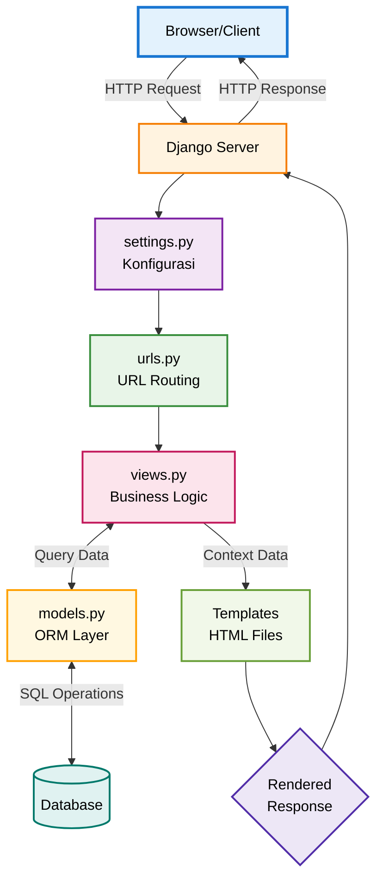

Repo: https://github.com/abiday/mpruy-united
Web: https://abid-dayyan-mpruyunited.pbp.cs.ui.ac.id/

## Implementasi Checklist

### 1. Persiapan Proyek dan Lingkungan

Langkah pertama adalah menyiapkan lingkungan kerja agar proses pengembangan lebih terstruktur dan dependensi pada proyek ini tidak bertabrakan dengan proyek lainnya.

Saya menggunakan **virtualenv** untuk membuat lingkungan Python yang khusus untuk proyek ini. Cara ini baik dilakukan agar package yang dipakai di proyek ini tidak bentrok dengan proyek lain.

Semua package yang dibutuhkan proyek saya daftarkan dalam file **requirements.txt**. Untuk meng-install semuanya, saya jalankan:

```bash
pip install -r requirements.txt
```

Saya membuat proyek Django baru dengan perintah:

```bash
django-admin startproject mpruy-united .
```

Dengan `mpruy-united` sebagai nama proyek saya, dan tanda `.` di akhir membuat file dan folder proyek di dalam direktori saat ini, bukan membuat folder baru lagi.

Setelah proyek jadi, saya membuat aplikasi utama bernama `main` dengan perintah:

```bash
python manage.py startapp main
```

---

### 2. Konfigurasi Routing Proyek

Selanjutnya, saya perlu menghubungkan aplikasi `main` dengan proyek Django utama.

* Pertama, aplikasi `main` saya daftarkan di dalam daftar `INSTALLED_APPS` pada file **settings.py** agar Django dapat mengenalinya.
* Kedua, pada file **urls.py** proyek, saya menambahkan:

```python
path('', include('main.urls'))
```

Artinya, setiap request yang masuk ke alamat utama web akan diteruskan ke file `urls.py` yang ada di dalam aplikasi `main`.

---

### 3. Pembuatan Model Product

Model di sini sebagai blueprint untuk data yang akan disimpan di database. Saya membuat model `Product` di dalam `main/models.py` dengan atribut-atribut:

* `name (CharField)` → Nama product
* `price (IntegerField)` → Harga product
* `description (TextField)` → Deskripsi product yang bisa panjang
* `thumbnail (URLField)` → Link gambar yang valid
* `category (CharField)` → Kategori product
* `is_featured (BooleanField)` → Status (True/False)

Setelah model selesai dibuat:

```bash
python manage.py makemigrations
python manage.py migrate
```

---

### 4. Pembuatan View, Template, dan Routing Aplikasi

Bagian ini bertujuan untuk menampilkan halaman web kepada pengguna.

* **View (views.py)**: Saya membuat fungsi `show_main` yang mengambil data (nama, kelas, dll.) lalu memasukkannya ke dictionary `context`, kemudian merender file `main.html` dengan context tersebut.
* **Template (main.html)**: File HTML sederhana di `main/templates/` yang menggunakan sintaks `{{ variabel }}` untuk menampilkan data.
* **Routing (main/urls.py)**: Saya mendefinisikan bahwa path kosong (`''`) ditangani oleh fungsi `show_main`.

---

### 5. Deployment ke PWS

Agar aplikasi bisa diakses online, saya deploy ke PWS.

* **Konfigurasi Produksi**: Menambahkan domain PWS ke `ALLOWED_HOSTS` di settings.py.
* **Push ke PWS**:

```bash
git remote add pws <url-remote>
git push pws master
```

---

## 2. Alur Proses Request dan Response pada Django (MVT)

### Bagan



### Penjelasan Alur

1. **Inisiasi Permintaan (HTTP Request)**
   Client (browser) mengirimkan request ke server, melalui browser web akan dikirim sebuah HTTP Request ke server untuk mengakses sebuah URL tertentu.
   
   Contoh: User mengetik https://abid-dayyan-mpruy-united.pbp.cs.ui.ac.id/products/ di browser dan menekan Enter.


2. **Resolusi URL (urls.py)**
   Dispatcher mencocokkan URL ke fungsi view. Jika cocok → jalankan view. Jika tidak → error 404.

   Contoh: Dalam urls.py, Django menemukan pola path('products/', views.show_products, name='show_products'). Karena cocok, Django akan memanggil fungsi bernama show_products yang ada di dalam views.py.


3. **Eksekusi Proses Bisnis (views.py)**
   View memproses data, interaksi model, dan menentukan response.

4. **Interaksi Data (models.py)**
   Jika view memerlukan akses ke database, maka view memanggil model → ORM → query SQL → database. Yang nantinya akan digunakan untuk mengambil atau memanipulasi data.

5. **Render Tampilan (Templates)**
   Data dari view dikirim ke template, view akan memuat file Template (.html) lalu di-render.

6. **Pengiriman Respons (HTTP Response)**
   Template yang sudah jadi kemudian dibungkus dalam sebuah objek HTTP Response, lalu dikirim balik ke client untuk ditampilkan. 

---

## 3. Peran settings.py dalam Proyek Django

File **settings.py** adalah pusat konfigurasi sebagai fondasi utama untuk proyek Django. Memiliki isi, semua pengaturan yang menentukan bagaimana proyek akan beroperasi.


* **INSTALLED\_APPS** → daftar aplikasi aktif
* **DATABASES** → konfigurasi koneksi database
* **Keamanan** → DEBUG, ALLOWED\_HOSTS
* **Lokasi proyek** → pengaturan TEMPLATES, static, dll.

---

## 4. Cara Kerja Migrasi Database di Django

1. `python manage.py makemigrations` → Membuat file migrasi berdasarkan perubahan models.py
2. `python manage.py migrate` → Menerapkan perubahan ke database

---

## 5. Mengapa Django Cocok untuk Pemula?

Menurut saya, Django sangat cocok untuk pemula karena membuat proses belajar lebih mudah. Django seperti memberikan satu paket lengkap berisi semua yang dibutuhkan. Selain itu, Django memberikan peta yang jelas tentang di mana harus meletakkan kode agar tidak berantakan, dan saya bisa mengelola basis data hanya dengan Python tanpa perlu menulis kode SQL. Ditambah lagi, Django punya dokumentasi yang lengkap dan digunakan oleh banyak perusahaan besar, yang nantinya akan elevan dan bermanfaat untuk persiapan karier di masa depan.

---

## 6. Feedback untuk Asisten Dosen

Sejauh ini tidak ada, guide dan ajaran dari asdos sudah baik dan sangat cukup untuk pemahaman dan implementasi materi-materi saat ini. Keterbukaannya untuk berdiskusi jika mengalami kebingungan atau kurang paham pada suatu materi atau tugas juga saya apresiasi, yang mana dapat membantu sekali terutama pada mata kuliah ini di mana saya masih sangat awam.

-----------------------------------------------------------------------------------------------------------------------------------------------------------------------------

## 1. Jelaskan mengapa kita memerlukan data delivery dalam pengimplementasian sebuah platform?

Secara sederhana, data delivery adalah backbone untuk berbagai bagian platform berkomunikasi satu sama lain. Seperti dapur adalah backend (tempat data diolah) dan meja pelanggan adalah frontend (tempat data ditampilkan). Data delivery adalah peran pelayan yang mengantarkan pesanan dari pelanggan ke dapur dan menyajikan makanan dari dapur ke pelanggan.

Kita memerlukannya karena:

1. Menghubungkan Backend dan Frontend untuk mengirimkan data dari server (logika) ke antarmuka pengguna (tampilan).
2. Agar berbagai layanan atau aplikasi yang berbeda, baik internal maupun eksternal, dapat saling berkomunikasi dan bertukar data.
3. Membuat tampilan lebih dinamis dengan memperbarui konten di halaman web secara real-time tanpa pengguna harus memuat ulang seluruh halaman.

## 2. Menurutmu, mana yang lebih baik antara XML dan JSON? Mengapa JSON lebih populer dibandingkan XML?

Tidak ada yang secara objektif "lebih baik", keduanya adalah format untuk menstrukturkan data, tapi untuk kasus penggunaan yang berbeda.

- XML untuk versi lebih verbose dan kaku, menggunakan tag pembuka dan penutup seperti HTML. Cocok untuk dokumen yang kompleks dan sistem yang memerlukan validasi ketat (seperti konfigurasi pada sistem enterprise).

- JSON untuk versi lebih ringkas dan mudah dibaca manusia, menggunakan format key-value pair. Strukturnya sangat mirip dengan objek pada JavaScript atau dictionary pada Python.

Mengapa JSON Lebih Populer?
1. Lebih Ringan
   JSON membutuhkan lebih sedikit teks untuk merepresentasikan data yang sama dibandingkan XML, sehingga transfer data lebih cepat.
2. Mudah Diolah (Parsing)
   Strukturnya sederhananya dapat langsung diubah menjadi objek asli di hampir semua bahasa pemrograman, terutama JavaScript. Karena JavaScript adalah bahasa utama di sisi browser.
3. Sangat Cocok untuk API
   Dengan semakin populernya REST API untuk menghubungkan frontend dan backend, JSON banyak dipakai sebagai standar utama karena formatnya yang sederhana dan mudah diproses.

## 3. Fungsi Method is_valid() pada Form Django

is_valid() adalah sebuah method pada objek form Django yang menjalankan seluruh proses validasi data yang dikirim oleh pengguna. Dengan:
1. Memeriksa semua data yang dikirimkan ke form.
2. Memvalidasi tipe data (misalnya, memastikan input angka adalah angka).
3. Menjalankan aturan validasi spesifik yang telah ditentukan (misalnya, panjang minimal password).
4. Jika semua data valid, method ini mengembalikan True dan menempatkan data yang sudah bersih di dalam atribut form.cleaned_data. Jika gagal, mengembalikan False dan mengisi atribut form.errors dengan detail kesalahan.

Kita membutuhkannya untuk memastikan integritas data, mencegah input berbahaya, dan memberikan feedback kesalahan yang jelas kepada pengguna.

## 4. Kebutuhan csrf_token pada Form Django
csrf_token dibutuhkan untuk mencegah serangan siber bernama Cross-Site Request Forgery (CSRF).

Tanpa csrf_token, form akan lebih rentan. Serangan CSRF terjadi ketika situs web berbahaya menipu browser pengguna untuk mengirimkan permintaan yang tidak diinginkan ke situs lain di mana pengguna tersebut sedang login.

Penyerang membuat halaman web palsu dengan form tersembunyi yang targetnya adalah aplikasi (misalnya, form untuk mengubah password atau mentransfer uang). Jika korban yang sedang login di aplikasi mengunjungi halaman palsu tersebut, browser-nya akan secara otomatis mengirimkan form tersembunyi itu. Server akan menganggapnya sebagai permintaan yang sah karena dikirim oleh browser pengguna yang sah. Akibatnya, penyerang berhasil melakukan tindakan atas nama korban tanpa disadari.

csrf_token mencegah ini dengan menambahkan sebuah kode rahasia unik pada form yang hanya diketahui oleh server dan browser pengguna. Permintaan tanpa kode rahasia yang cocok akan langsung ditolak.

## 5. Implementasi Tugas

1. Penyediaan Data dalam Format XML & JSON
Untuk menyediakan data produk dalam format yang dapat dibaca mesin, file main/views.py mengimplementasikan empat fungsi baru: show_json, show_xml, show_json_by_id, dan show_xml_by_id. Keempat fungsi ini bertugas untuk mengambil data produk dari database. Proses konversi dari data QuerySet ke format JSON dan XML didukung oleh serializer internal yang disediakan oleh Django.

2. Pemetaan URL untuk Akses Data
Agar setiap view yang baru dapat diakses melalui URL, diperlukan pemetaan baru di dalam file main/urls.py. Konfigurasi ini memastikan bahwa permintaan ke endpoint tertentu akan diarahkan ke fungsi yang sesuai. Berikut adalah path yang ditambahkan:

path('xml/', show_xml, name='show_xml')
path('json/', show_json, name='show_json')
path('xml/<str:product_id>/', show_xml_by_id, name='show_xml_by_id')
path('json/<str:product_id>/', show_json_by_id, name='show_json_by_id')

3. Implementasi Halaman Utama dan Detail Produk
Untuk struktur halaman yang konsisten dan menghindari kode redundan, saya membuat base.html dibuat di direktori utama. Selanjutnya, halaman main.html diubah untuk mewarisi (inherit) struktur dari base.html. Fungsionalitas utama dari halaman main.html adalah untuk menampilkan seluruh daftar produk. Halaman ini juga dilengkapi dengan elemen navigasi, termasuk tombol yang mengarah ke formulir tambah produk (add_product.html) dan tautan unik pada setiap produk untuk melihat detailnya (product_detail.html).

4. Pengembangan Formulir Tambah Produk
Untuk menangani input data produk dari pengguna, saya membuat file forms.py di dalam direktori main. Di dalamnya, didefinisikan sebuah kelas form yang strukturnya sesuai dengan model produk. Antarmuka pengguna untuk formulir ini kemudian dibuat dalam sebuah template bernama add_product.html. Template ini akan me-render form yang telah didefinisikan, menggunakan placeholder {{ form.as_table }} untuk menampilkannya dalam format tabel.

5. Pembuatan Halaman Detail Produk
Sebuah template baru, product_detail.html, dikembangkan untuk menampilkan informasi lengkap dari satu produk. Template ini dirancang untuk menerima satu objek produk dan menyajikan seluruh atributnya kepada pengguna. Sebagai tambahan, halaman ini juga dilengkapi dengan tombol navigasi yang memungkinkan pengguna untuk kembali ke halaman daftar produk utama.

## 6. Apakah ada feedback untuk asdos di tutorial 2 yang sudah kalian kerjakan?
Sejauh ini bantuan dari asdos sudah sangat cukup yang memungkinkan pengerjaan tutorial menjadi lebih lancar, dengan arahan dan bantuan yang sesuai ketika saya mengalami error kemarin.

## Bukti screenshot POSTMAN
https://drive.google.com/file/d/1DkimOhVVsfNOZ6pUStl7VPUMW-7LiAok/view?usp=sharing

https://drive.google.com/file/d/1WE37-n8In-EA6iI5WrmZf9ZZZx3Wpi_c/view?usp=sharing


-----------------------------------------------------------------------------------------------------------------------------------------------------------------------------

## 1. Apa itu Django AuthenticationForm? Jelaskan juga kelebihan dan kekurangannya.
AuthenticationForm adalah form bawaan Django untuk proses login pengguna. Tugas utamanya adalah menerima username dan password dari pengguna, lalu memverifikasi apakah kredensial tersebut valid dan cocok dengan pengguna yang aktif di database.

Kelebihan:
- Siap pakai karena sudah disediakan oleh django, jadi mempercepat proses development karena tidak perlu membuat form login dari awal
- Aman karena otomatis menangani validasi keamanan dasar, seperti memeriksa apakah pengguna berstatus aktif (is_active) sebelum mengizinkan login
- Sudah terintegrasi dengan sistem autentikasi Django lainnya seperti login() dan logout()

Kekurangan:
- Memiliki fitur terbatas dengan field hanya username dan password, jadi fitur tambahan seperti "Remember Me" perlu dicustom lebih lanjut
- Hanya untuk autentikasi menggunakan username. Jika ingin menggunakan email sebagai gantinya, perlu disesuaikan dengan khusus

## 2. Apa perbedaan antara autentikasi dan otorisasi? Bagaiamana Django mengimplementasikan kedua konsep tersebut?

# Autentikasi (Authentication) menjawab pertanyaan, "Siapa Anda?"
Ini adalah proses memverifikasi identitas. Contohnya saat memasukkan username dan password untuk membuktikan bahwa user adalah pemilik akun tersebut.

# Otorisasi (Authorization) menjawab pertanyaan, "Apa yang boleh Anda lakukan?" 
Ini adalah proses menentukan hak akses atau izin yang dimiliki oleh user yang identitasnya telah terverifikasi. Contohnya, meskipun Anda dan seorang admin sama-sama berhasil login (autentikasi), hanya admin yang memiliki izin (otorisasi) untuk mengakses halaman admin.

# Implementasi di Django
Autentikasi melalui django.contrib.auth. Ini mencakup model User, form seperti AuthenticationForm, dan fungsi-fungsi inti seperti authenticate() (untuk memeriksa kredensial) dan login() (untuk memulai sesi pengguna).

Otorisasi melalui sistem perizinan (permissions). Ini termasuk flag pada model User (seperti is_staff dan is_superuser), izin granular (misalnya can_add_product), dan Grup untuk menerapkan serangkaian izin ke banyak pengguna sekaligus. Untuk melindungi view, Django menyediakan decorators seperti @login_required dan @permission_required.

## 3. Apa saja kelebihan dan kekurangan session dan cookies dalam konteks menyimpan state di aplikasi web?

# Cookies: Data disimpan langsung di browser pengguna.

Kelebihan:
- Beban Server Ringan karena data disimpan di sisi klien, jadi tidak membebani penyimpanan server
- Sederhana dan mudah diimplementasikan untuk data yang tidak sensitif seperti preferensi tema (gelap/terang)

Kekurangan:
- Tidak Aman karena data dapat dilihat dan diubah oleh pengguna, sehingga sangat tidak cocok untuk menyimpan informasi sensitif (misalnya, ID pengguna)
- Ukuran cookie sangat kecil (sekitar 4KB)
- User dapat menonaktifkan cookies di browser mereka

# Session adalah sebuah ID unik yang disimpan di cookie pengguna. Data aslinya disimpan di sisi server (misalnya, di database).

Kelebihan:
- Aman karena data sensitif tersimpan aman di server, tidak dapat diakses langsung oleh pengguna
- Ukuran fleksibel karena tidak ada batasan ukuran data yang signifikan selain kapasitas penyimpanan server

Kekurangan:
- Beban server lebih berat karena perlu resource server untuk menyimpan dan mengelola data sesi, yang bisa menjadi masalah pada skala besar

## 4. Apakah penggunaan cookies aman secara default dalam pengembangan web, atau apakah ada risiko potensial yang harus diwaspadai? Bagaimana Django menangani hal tersebut?

Secara default, penggunaan cookies tidak aman. Ada beberapa risiko:

# Risiko Potensial
Pencurian (XSS): Jika situs rentan terhadap Cross-Site Scripting (XSS), penyerang bisa menyuntikkan skrip untuk mencuri cookies pengguna, termasuk cookie sesi yang bisa digunakan untuk membajak akun.

Pemalsuan (CSRF): Penyerang bisa menipu browser pengguna untuk mengirim permintaan ke situs Anda menggunakan cookie yang sudah ada, memaksa pengguna melakukan tindakan yang tidak diinginkan.

Penyadapan: Jika situs tidak menggunakan HTTPS, cookies dikirim sebagai teks biasa dan dapat disadap oleh pihak ketiga di jaringan yang sama.

# Implementasi Protection dari Django
- Menyimpan data penting di server, seperti username tidak di cookie. Yang disimpan cuma semacam kunci sesi yang random dan aman. Data aslinya tetap di server jadi tidak bisa diintip dari server'
- Django otomatis menandai flag HttpOnly di cookie. Yang artinya "Jangan biarkan JavaScript menyentuh cookie ini" Sehingga aman dari XSS
- Setiap form yang mengirim data (misalnya POST) wajib punya csrf_token. Ini memastikan permintaan yang masuk benar-benar dari situs kita, bukan dari situs lain yang mencoba menipu
- Django juga menyediakan pengaturan seperti SESSION_COOKIE_SECURE = True untuk memaksa browser agar hanya mengirim cookie lewat koneksi HTTPS yang aman

## 5. Implementasi Tugas 4

Berikut langkah-langkah implementasi autentikasi (registrasi, login, logout), pembatasan akses halaman, penggunaan cookies `last_login`, pengaitan model `Shop` dengan `User`, serta pengisian data dummy melalui website.

### A. Persiapan Model dan Migrasi
- Model `Shop` sudah terhubung ke `User` melalui field `user` di `main/models.py`.
- Jalankan migrasi bila diperlukan:

```bash
python manage.py makemigrations
python manage.py migrate
```

### B. Form Registrasi & Login
- Buat form registrasi berbasis `UserCreationForm` dan gunakan `AuthenticationForm` untuk login di `main/forms.py`.
- Template: `main/templates/register.html` dan `main/templates/login.html` menampilkan form dan menyertakan ``.

### C. View Registrasi, Login, Logout, dan Proteksi
- Di `main/views.py`:
  - `register`: render dan proses form; sukses → redirect ke login.
  - `login_user`: verifikasi kredensial, `login(request, user)`, set cookie `last_login`, redirect ke halaman utama.
  - `logout_user`: `logout(request)`, hapus cookie `last_login`, redirect ke login.
  - Terapkan `@login_required` untuk `show_main` dan `product_detail` agar hanya bisa diakses setelah login.
  - Saat membuat product, set kepemilikan: `Shop(user=request.user, ...)`.

Contoh pengaturan cookie:

```python
# saat login sukses
response = HttpResponseRedirect(reverse('main:show_main'))
response.set_cookie('last_login', str(datetime.datetime.now()))
return response

# saat logout
response = HttpResponseRedirect(reverse('main:login'))
response.delete_cookie('last_login')
return response
```

### D. URL Routing
- Tambah path di `main/urls.py`:

```python
path('register/', register, name='register')
path('login/', login_user, name='login')
path('logout/', logout_user, name='logout')
path('', show_main, name='show_main')
path('product/<int:id>/', product_detail, name='product_detail')
path('create-product/', create_product, name='create_product')
```

### E. Template
- `main.html` menampilkan:
  - Username pengguna: `{{ user.username }}`
  - Nilai cookie: `{{ request.COOKIES.last_login }}` (opsional)
  - Daftar product yang dimiliki user login.
- `product_detail.html` menampilkan detail product tunggal.
- `create_product.html` menampilkan form tambah product.

### F. Redirect Login Otomatis
- Di `settings.py`, pastikan:

```python
LOGIN_URL = '/login/'
```

### G. Pengisian Data Dummy via Website (2 akun × 3 product)
1) Buka aplikasi di web lalu buat dua akun melalui halaman Register:
   - Username: `dum`, Password: `dummy123`
   - Username: `dum2`, Password: `dummy123`

2) Login sebagai `dum` lalu tambahkan 3 product melalui halaman tambah product (`create_product`). Ulangi proses sebagai `dum2` dan tambahkan 3 product. Setiap product otomatis terhubung dengan user yang sedang login.

### H. Verifikasi
- Jalankan server:

```bash
python manage.py runserver
```

- Pastikan:
  - Registrasi, login, logout berfungsi.
  - `show_main` dan `product_detail` hanya bisa diakses setelah login.
  - `{{ user.username }}` dan cookie `last_login` tampil sesuai.
  - product yang terlihat sesuai kepemilikan user (`dum` vs `dum2`).

---------------------------------------------------------------------------------------------------------------------------------------------------------------
## Tugas 5
## 1. Urutan Prioritas CSS Selector (Specificity)

Ketika beberapa aturan CSS menargetkan elemen HTML yang sama, browser akan menentukan aturan mana yang akan diterapkan berdasarkan urutan prioritas atau **specificity**. Urutan prioritas dari yang **tertinggi** hingga **terendah** adalah sebagai berikut:

1.  **Inline Styles**: Atribut `style` yang ditulis langsung pada elemen HTML.
    * Contoh: `<div style="color: red;"></div>`
2.  **ID Selector**: Selector yang menargetkan atribut `id` unik sebuah elemen.
    * Contoh: `#header { background-color: blue; }`
3.  **Class, Attribute, dan Pseudo-class Selectors**: Selector yang menargetkan elemen berdasarkan `class`, atribut (misalnya, `[type="text"]`), atau status tertentu (misalnya, `:hover`).
    * Contoh: `.button { color: white; }`
4.  **Element (Type) Selector**: Selector yang menargetkan semua elemen dengan nama tag yang sama.
    * Contoh: `p { font-size: 16px; }`
5.  **Universal Selector (`*`)**: Menargetkan semua elemen.

**Catatan Penting**: Penggunaan `!important` pada sebuah properti CSS akan mengesampingkan semua aturan prioritas lainnya, menjadikannya yang paling utama. Namun, penggunaannya tidak disarankan karena dapat mempersulit proses *debugging*.

---

## 2. Pentingnya Responsive Design

**Responsive design** adalah sebuah pendekatan dalam pengembangan web yang membuat tampilan situs web dapat beradaptasi dengan berbagai ukuran layar dan perangkat, mulai dari desktop hingga tablet dan *smartphone*. Konsep ini sangat penting karena:

* **Meningkatkan Pengalaman Pengguna (User Experience)**: Pengguna dapat mengakses konten dengan nyaman di perangkat apa pun tanpa perlu melakukan *zoom* atau *scroll* berlebihan.
* **Meningkatkan Jangkauan Audiens**: Dengan semakin banyaknya pengguna yang mengakses internet melalui perangkat mobile, situs yang responsif dapat menjangkau audiens yang lebih luas.
* **Meningkatkan SEO**: Google memprioritaskan situs yang *mobile-friendly* dalam hasil pencariannya.
* **Mempermudah Perawatan**: Cukup dengan satu basis kode untuk semua perangkat, tidak perlu membuat versi mobile dan desktop yang terpisah.

### Contoh Aplikasi:

* **Sudah Menerapkan (Responsive)**: **Tokopedia**. Tampilan situs e-commerce ini akan menyesuaikan tata letak produk, ukuran font, dan navigasi saat dibuka di desktop, tablet, maupun *smartphone*, sehingga pengalaman berbelanja tetap optimal.
* **Belum Menerapkan (Non-Responsive)**: **Situs-situs web lama** (contoh spesifik sulit ditemukan karena banyak yang sudah diperbarui). Situs-situs ini seringkali memiliki tampilan yang tetap (*fixed-width*). Saat dibuka di perangkat mobile, tampilannya akan menjadi sangat kecil dan sulit dinavigasi, memaksa pengguna untuk memperbesar dan menggeser layar secara manual.

---

## 3. Perbedaan Margin, Border, dan Padding (Box Model)

Ketiga properti ini adalah komponen fundamental dari **CSS Box Model**, yang mendefinisikan bagaimana elemen HTML dirender sebagai "kotak" pada halaman.

* **Padding**: Ruang transparan **di dalam** *border* yang mengelilingi konten (teks, gambar, dll.). Padding berfungsi untuk memberikan jarak antara konten dengan *border*.
* **Border**: Garis yang berada **di antara** *padding* dan *margin*. *Border* bisa diatur ketebalan, gaya (misalnya, solid, dashed), dan warnanya.
* **Margin**: Ruang transparan **di luar** *border*. *Margin* berfungsi untuk memberikan jarak antara elemen tersebut dengan elemen lain di sekitarnya.

### Implementasi:

```css
.box {
  /* Padding: 10px di semua sisi (atas, kanan, bawah, kiri) */
  padding: 10px;

  /* Border: 2px, garis solid, warna hitam */
  border: 2px solid black;

  /* Margin: 15px di semua sisi */
  margin: 15px;

  /* Anda juga bisa mengaturnya secara individual */
  padding-top: 5px;
  border-left: 5px dotted red;
  margin-bottom: 20px;
}

## Implementasi Checklist Tugas 5
Untuk fungsionalitas produk, saya menambahkan fitur **edit dan hapus**. Hal ini diimplementasikan dengan memodifikasi file `main/views.py` untuk menambahkan fungsi `edit_product` dan `delete_product`. Agar kedua fungsi tersebut dapat diakses melalui URL, saya menambahkan routing baru di dalam `main/urls.py` yang menargetkan produk berdasarkan ID uniknya.

```python
path('product/<str:id>/edit', edit_product, name='edit_product'),
path('product/<str:id>/delete', delete_product, name='delete_product'),

Untuk kustomisasi design:
Pada sisi desain, saya memilih Tailwind CSS karena filosofi utility-first-nya karena bisa kontrol penuh dan performanya maksimal. Pendekatan ini membuat saya bisa merancang antarmuka yang unik dan punya identitas kuat, bukan sekadar menjiplak template yang sudah ada.

Membuat desain yang adaptif untuk berbagai perangkat pun terasa lebih intuitif dengan prefix responsifnya:
Keunggulan utamanya adalah kecepatan: Tailwind memastikan file CSS akhir sangat kecil karena hanya menyertakan style yang digunakan. Hasilnya adalah website yang memuat lebih cepat dan memberikan pengalaman pengguna yang lebih baik.