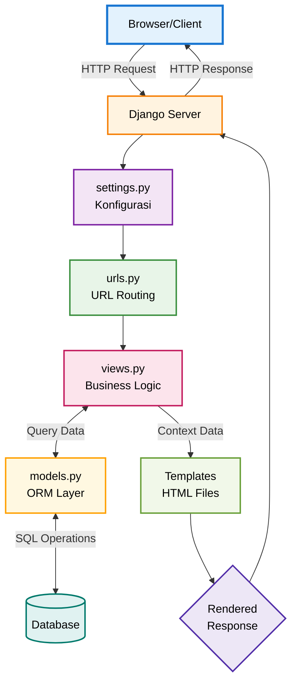

## Implementasi Checklist

### 1. Persiapan Proyek dan Lingkungan

Langkah pertama adalah menyiapkan lingkungan kerja agar proses pengembangan lebih terstruktur dan dependensi pada proyek ini tidak bertabrakan dengan proyek lainnya.

Saya menggunakan **virtualenv** untuk membuat lingkungan Python yang khusus untuk proyek ini. Cara ini baik dilakukan agar package yang dipakai di proyek ini tidak bentrok dengan proyek lain.

Semua package yang dibutuhkan proyek saya daftarkan dalam file **requirements.txt**. Untuk meng-install semuanya, saya jalankan:

```bash
pip install -r requirements.txt
```

Saya membuat proyek Django baru dengan perintah:

```bash
django-admin startproject mpruy-united .
```

Dengan `mpruy-united` sebagai nama proyek saya, dan tanda `.` di akhir membuat file dan folder proyek di dalam direktori saat ini, bukan membuat folder baru lagi.

Setelah proyek jadi, saya membuat aplikasi utama bernama `main` dengan perintah:

```bash
python manage.py startapp main
```

---

### 2. Konfigurasi Routing Proyek

Selanjutnya, saya perlu menghubungkan aplikasi `main` dengan proyek Django utama.

* Pertama, aplikasi `main` saya daftarkan di dalam daftar `INSTALLED_APPS` pada file **settings.py** agar Django dapat mengenalinya.
* Kedua, pada file **urls.py** proyek, saya menambahkan:

```python
path('', include('main.urls'))
```

Artinya, setiap request yang masuk ke alamat utama web akan diteruskan ke file `urls.py` yang ada di dalam aplikasi `main`.

---

### 3. Pembuatan Model Product

Model di sini sebagai blueprint untuk data yang akan disimpan di database. Saya membuat model `Product` di dalam `main/models.py` dengan atribut-atribut:

* `name (CharField)` → Nama item
* `price (IntegerField)` → Harga item
* `description (TextField)` → Deskripsi item yang bisa panjang
* `thumbnail (URLField)` → Link gambar yang valid
* `category (CharField)` → Kategori item
* `is_featured (BooleanField)` → Status (True/False)

Setelah model selesai dibuat:

```bash
python manage.py makemigrations
python manage.py migrate
```

---

### 4. Pembuatan View, Template, dan Routing Aplikasi

Bagian ini bertujuan untuk menampilkan halaman web kepada pengguna.

* **View (views.py)**: Saya membuat fungsi `show_main` yang mengambil data (nama, kelas, dll.) lalu memasukkannya ke dictionary `context`, kemudian merender file `main.html` dengan context tersebut.
* **Template (main.html)**: File HTML sederhana di `main/templates/` yang menggunakan sintaks `{{ variabel }}` untuk menampilkan data.
* **Routing (main/urls.py)**: Saya mendefinisikan bahwa path kosong (`''`) ditangani oleh fungsi `show_main`.

---

### 5. Deployment ke PWS

Agar aplikasi bisa diakses online, saya deploy ke PWS.

* **Konfigurasi Produksi**: Menambahkan domain PWS ke `ALLOWED_HOSTS` di settings.py.
* **Push ke PWS**:

```bash
git remote add pws <url-remote>
git push pws master
```

---

## 2. Alur Proses Request dan Response pada Django (MVT)

### Bagan



### Penjelasan Alur

1. **Inisiasi Permintaan (HTTP Request)**
   Client (browser) mengirimkan request ke server, melalui browser web akan dikirim sebuah HTTP Request ke server untuk mengakses sebuah URL tertentu.
   
   Contoh: Pengguna mengetik https://abid-dayyan-mpruy-united.pbp.cs.ui.ac.id/items/ di browser dan menekan Enter.


2. **Resolusi URL (urls.py)**
   Dispatcher mencocokkan URL ke fungsi view. Jika cocok → jalankan view. Jika tidak → error 404.

   Contoh: Dalam urls.py, Django menemukan pola path('items/', views.show_items, name='show_items'). Karena cocok, Django akan memanggil fungsi bernama show_items yang ada di dalam views.py.


3. **Eksekusi Proses Bisnis (views.py)**
   View memproses data, interaksi model, dan menentukan response.

4. **Interaksi Data (models.py)**
   Jika view memerlukan akses ke database, maka view memanggil model → ORM → query SQL → database. Yang nantinya akan digunakan untuk mengambil atau memanipulasi data.

5. **Render Tampilan (Templates)**
   Data dari view dikirim ke template, view akan memuat file Template (.html) lalu di-render.

6. **Pengiriman Respons (HTTP Response)**
   Template yang sudah jadi kemudian dibungkus dalam sebuah objek HTTP Response, lalu dikirim balik ke client untuk ditampilkan. 

---

## 3. Peran settings.py dalam Proyek Django

File **settings.py** adalah pusat konfigurasi sebagai fondasi utama untuk proyek Django. Memiliki isi, semua pengaturan yang menentukan bagaimana proyek akan beroperasi.


* **INSTALLED\_APPS** → daftar aplikasi aktif
* **DATABASES** → konfigurasi koneksi database
* **Keamanan** → DEBUG, ALLOWED\_HOSTS
* **Lokasi proyek** → pengaturan TEMPLATES, static, dll.

---

## 4. Cara Kerja Migrasi Database di Django

1. `python manage.py makemigrations` → Membuat file migrasi berdasarkan perubahan models.py
2. `python manage.py migrate` → Menerapkan perubahan ke database

---

## 5. Mengapa Django Cocok untuk Pemula?

Menurut saya, Django sangat cocok untuk pemula karena membuat proses belajar lebih mudah. Django seperti memberikan satu paket lengkap berisi semua yang dibutuhkan. Selain itu, Django memberikan peta yang jelas tentang di mana harus meletakkan kode agar tidak berantakan, dan saya bisa mengelola basis data hanya dengan Python tanpa perlu menulis kode SQL. Ditambah lagi, Django punya dokumentasi yang lengkap dan digunakan oleh banyak perusahaan besar, yang nantinya akan elevan dan bermanfaat untuk persiapan karier di masa depan.

---

## 6. Feedback untuk Asisten Dosen

Sejauh ini tidak ada, guide dan ajaran dari asdos sudah baik dan sangat cukup untuk pemahaman dan implementasi materi-materi saat ini. Keterbukaannya untuk berdiskusi jika mengalami kebingungan atau kurang paham pada suatu materi atau tugas juga saya apresiasi, yang mana dapat membantu sekali terutama pada mata kuliah ini di mana saya masih sangat awam.

